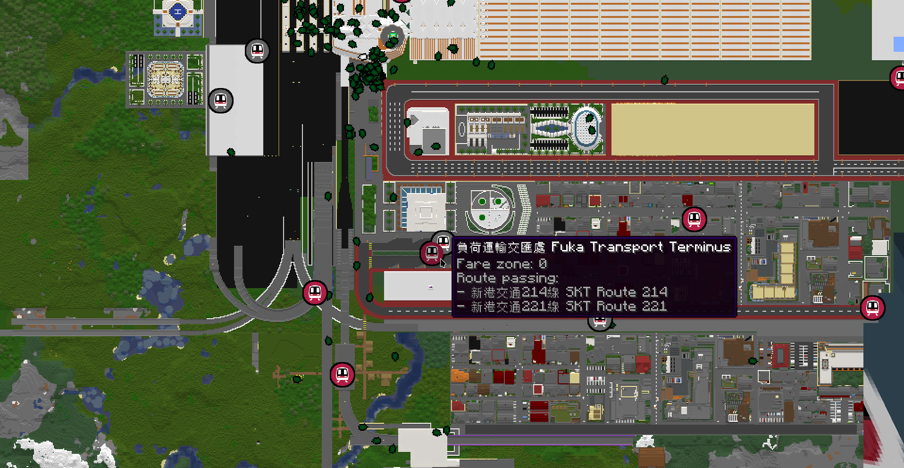

# MTR: Surveyor Integration

This mod automatically adds stations & depots landmarks from [Minecraft Transit Railway 4](https://github.com/Minecraft-Transit-Railway/Minecraft-Transit-Railway) to the [Surveyor Map Framework](https://github.com/sisby-folk/surveyor).

This enables mods utilizing **Surveyor** (e.g. Hoofprint) to display such landmarks on the map.

## Sinytra Connector Compatibility

This should work with **Sinytra Connector** on Forge/NeoForge, provided you have the following mods installed:
- Sinytra Connector
- Forgified Fabric API / FFAPI
- Minecraft Transit Railway 4.x (Forge)
- - Note: No need to run the Fabric version of MTR via connector, just use the Forge build!

## Config
The config file is located under `.minecraft/config/mtrsurveyor.json`.

## Commands
- `/mtrsurveyor config addDepotLandmarks (false/true)` - Query or set whether depot landmarks should be added to the map.
- `/mtrsurveyor config addStationLandmarks (false/true)` - Query or set whether station landmarks should be added to the map.
- `/mtrsurveyor config autoSync (false/true)` - Query or set whether landmarks should be automatically created & synced when an MTR-related change occurs.
- `/mtrsurveyor config reload` - Reload the config from `.minecraft/config/mtrsurveyor.json`.
- `/mtrsurveyor config showHiddenRoute (false/true)` - Query or set whether hidden routes in MTR should be appended to the station description.
- `/mtrsurveyor config showStationWithNoRoute (false/true)` - Query or set whether empty stations (i.e. with no routes) should be added to the map.
- `/mtrsurveyor clearLandmarks <world id>` - Clear all landmarks for the specified world (Note: Landmarks will appear again when MTR stations/depots changed if auto sync is enabled, see above to disable)
- `/mtrsurveyor syncLandmarks <world id>` - Sync & update all landmarks for the specified world

## License
This project is licensed under the MIT License.